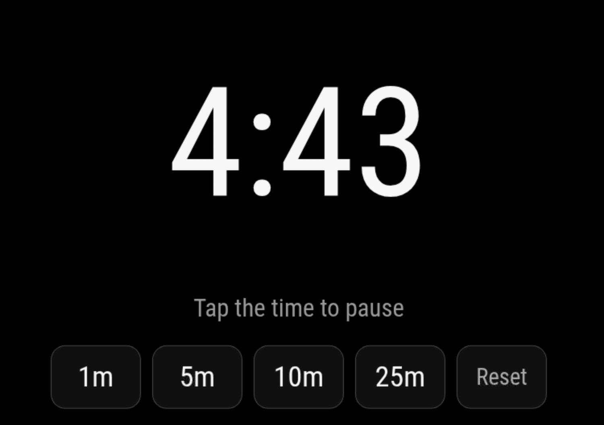

# MMM-KitchenTimer

A responsive, touch-friendly countdown timer for [MagicMirror²](https://magicmirror.builders/).

Originally created by [Tom Short](https://github.com/tshort). This maintained edition preserves the original configuration while adding reliable wall-clock timing, accessible controls, compact and full-screen layouts, and a notification API.



## Installation

```sh
cd ~/MagicMirror/modules
git clone https://github.com/bwente/MMM-KitchenTimer.git
```

No production dependencies are required.

## Configuration

```js
{
  module: "MMM-KitchenTimer",
  position: "fullscreen_above",
  config: {
    timertext: ["1m", "5m", "10m", "25m"],
    timersecs: [60, 300, 600, 1500],
    title: "Timer",
    sound: true
  }
}
```

Existing `timertext` and `timersecs` configurations remain compatible.

| Option | Default | Description |
| --- | --- | --- |
| `timertext` | `["1m", "5m", "20m"]` | Labels for the duration buttons. |
| `timersecs` | `[60, 300, 1200]` | Seconds added by each corresponding button. |
| `title` | `"Timer"` | Heading shown above the timer. |
| `compact` | `false` | Use the smaller region-friendly layout. |
| `showReset` | `true` | Show Reset/Dismiss control. |
| `sound` | `true` | Loop the alarm when the timer finishes. |
| `soundFile` | `"alarm.wav"` | Alarm file within the module directory. |
| `playButtonSound` | `true` | Play feedback for controls. |
| `buttonSoundFile` | `"beep.wav"` | Button feedback file. |
| `buttonSoundVolume` | `0.2` | Button feedback volume from 0 to 1. |
| `broadcastTicks` | `true` | Broadcast a semantic progress update once per changed second. |

## Controls

- Press a preset to add its duration and start the timer.
- Press the large time display to pause or resume.
- Press Reset in the preset row to cancel an active timer.
- Press Dismiss after the alarm sounds.

All controls are ordinary accessible HTML buttons and work with touch, mouse, and keyboard activation.

## Incoming notifications

| Notification | Payload | Action |
| --- | --- | --- |
| `KITCHEN_TIMER_START` | seconds or `{ seconds }` | Replace the duration and start. |
| `KITCHEN_TIMER_ADD` | seconds or `{ seconds }` | Add time and start if necessary. |
| `KITCHEN_TIMER_PAUSE` | — | Pause. |
| `KITCHEN_TIMER_RESUME` | — | Resume. |
| `KITCHEN_TIMER_TOGGLE` | — | Pause or resume. |
| `KITCHEN_TIMER_RESET` | — | Cancel and return to idle. |
| `KITCHEN_TIMER_DISMISS` | — | Stop the alarm and return to idle. |

For compatibility with other modules, `START_TIMER`, `PAUSE_TIMER`, `UNPAUSE_TIMER`, and `RESET_TIMER` are also accepted.

## Outgoing notifications

The module broadcasts state snapshots containing `status`, `remainingSeconds`, and `endsAt`:

- `KITCHEN_TIMER_STARTED`
- `KITCHEN_TIMER_UPDATED`
- `KITCHEN_TIMER_PAUSED`
- `KITCHEN_TIMER_RESUMED`
- `KITCHEN_TIMER_FINISHED`
- `KITCHEN_TIMER_TICK`
- `KITCHEN_TIMER_RESET`
- `KITCHEN_TIMER_DISMISSED`

These semantic events allow sound, lights, GPIO controls, voice assistants, and notification centers to integrate without adding hardware-specific code to this module. Payloads include `durationSeconds` and `elapsedRatio`; tick events are emitted at most once per changed second.

## Development

```sh
npm test
```

Tests use Node's built-in test runner and install no dependencies.
